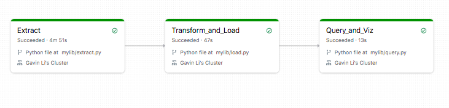
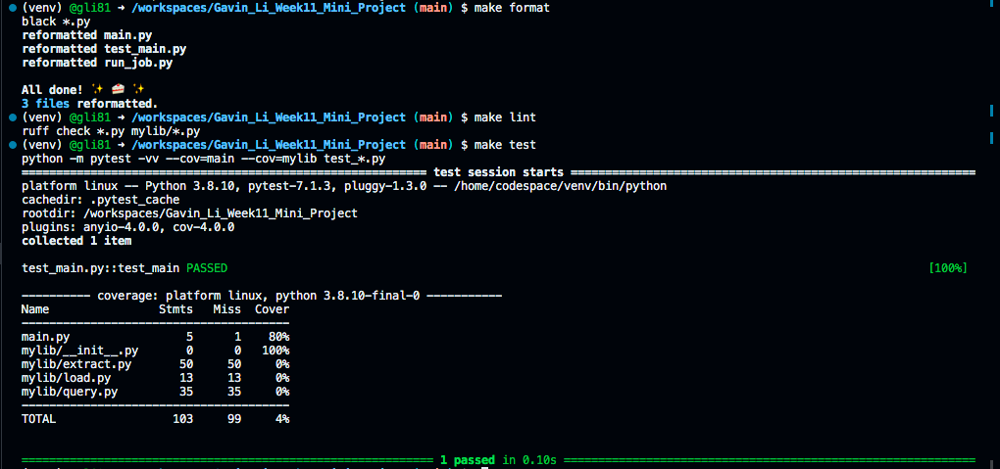

# IDS 706 Data Engineering Week 11 Mini Project
Gavin Li `gl183`

## Purpose of the project
The purpose of this project is to build an ETL data pipeline to process at least one data source on Databricks, and make use of a data sink.

## ETL data pipeline

- [E]xtract

  Retrived the data from the data source using python `requests` package, then stored the data in databricks using the `dbfs` protocol as a `.csv` file.
- [T]ransform

  Dropped unnecessary columns, leaving only the variables that are useful to later analysis (e.g., `Survived`, `Sex`, `Pclass`)
- [L]oad

  Loaded the transformed data set into a delta lake table.

I also made an automation to run the ETL workflow automatically, and here is the result of the workflow.

## Result of `make format`, `make lint`, `make test`

## Reference

[Professor Noah's ruff template](https://github.com/nogibjj/python-ruff-template)